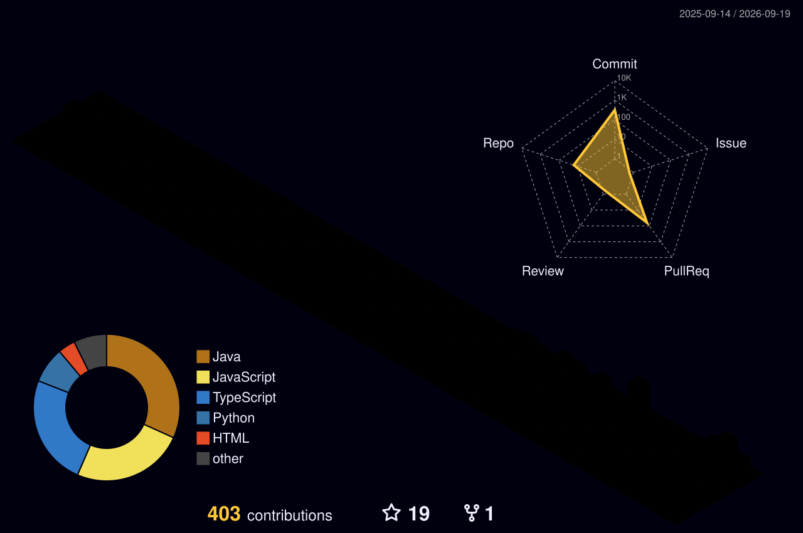

<div align="center">


<br/>

<a href="https://instagram.com/n4kusu">
  
</a>
<a href="https://github.com/Nakusuo?tab=repositories">
  
</a>


<br/>


</div>


## `>` whoami

```ts
const nakusu = {
  rol:        "Estudiante de Ingeniería de Software · 3er año",
  ahora:      ["Huecko", "SafeZone", "Clínica Biométrica"],
  frontend:   ["React", "TypeScript", "Tailwind", "Vite"],
  backend:    ["Spring Boot", "FastAPI", "PostgreSQL"],
  tambien:    ["diseño", "ilustración", "3D", "edición"],
  filosofia:  "si se ve bien y además funciona, mejor",
};
```

Me muevo entre el diseño y el código: me importa tanto que la arquitectura tenga
sentido como que la interfaz se sienta bien de usar. Aquí subo proyectos de
universidad, prácticas y cosas que hago por curiosidad.


## `>` en qué ando

<details open>
<summary><b>🗓️ &nbsp;Huecko</b> &nbsp;—&nbsp; coordinar planes entre amigos sin 40 mensajes de WhatsApp</summary>

<br/>

Sistema completo en tres repos. Los usuarios registran su disponibilidad
(bloques recurrentes y puntuales), la app cruza horarios y propone ventanas
donde el grupo realmente coincide.

- **Heatmap semanal** de disponibilidad del grupo, con umbral configurable
- **Propuestas con votación**: 2–5 ventanas, confirmación, retrasos e imprevistos
- **Importación OCR** de horarios en borrador
- Modo demo sin backend + backend stub para desarrollo
- Contrato de API documentado entre front y Spring Boot


**Repos:** [`huecko-frontend`](https://github.com/Nakusuo/huecko-frontend) · [`huecko-backend`](https://github.com/Nakusuo/huecko-backend) · [`huecko-ai-service`](https://github.com/Nakusuo/huecko-ai-service)

</details>

<details>
<summary><b>🛡️ &nbsp;SafeZone</b> &nbsp;—&nbsp; plataforma de apoyo a víctimas de violencia</summary>

<br/>

Cuatro roles, cuatro dashboards: administradora, víctima, psicóloga y defensor
legal. Arquitectura *feature-based* pensada para que cada dominio crezca por
separado.

- **Botón de pánico** flotante con geolocalización GPS, alternativa manual y
  countdown de 10s antes del auto-envío
- **Panel de alertas en tiempo real** para que las profesionales atiendan y
  resuelvan casos
- Gestión de denuncias por tipo de violencia
- Modo mock ↔ backend real conmutable por variable de entorno


**Repo:** [`SafeZone_Frontend`](https://github.com/Nakusuo/SafeZone_Frontend)

</details>

<details>
<summary><b>🩺 &nbsp;Clínica Biométrica</b> &nbsp;—&nbsp; telemedicina con login facial</summary>

<br/>

API de telemedicina: pacientes, doctores, citas y expedientes, con
autenticación JWT y un endpoint de *facial-login*. Documentada en Swagger
desde el primer commit.


**Repos:** [`Backend-ClinicaBiometrica`](https://github.com/Nakusuo/Backend-ClinicaBiometrica) · [`Frontend-ClinicaBiometrica`](https://github.com/Nakusuo/Frontend-ClinicaBiometrica)

</details>

<details>
<summary><b>📚 &nbsp;Universidad y prácticas</b></summary>

<br/>

Repos de curso donde voy dejando ejercicios y entregas: `Lenguajes_Programacion-Frontend`,
`semana14-DWI`, `5minutos`. No son portafolio, son el registro de cómo voy aprendiendo.

</details>


## `>` stack

<details open>
<summary><b>Lo que uso a diario</b></summary>

<br/>


</details>

<details>
<summary><b>Diseño y visuales</b></summary>

<br/>


</details>

<details>
<summary><b>En la lista de aprender</b></summary>

<br/>


</details>


## `>` métricas

<div align="center">


<br/>


</div>


## `>` mis commits, pero como videojuego

<div align="center">
  
</div>

<div align="center">
  
</div>


## `>` últimos movimientos

<!--START_SECTION:activity-->
<!--END_SECTION:activity-->


<div align="center">
  <sub><code>~/Nakusuo</code> &nbsp;·&nbsp; construido con demasiado café y atajos de teclado ☕</sub>
</div>
