<!--
   ┌─────────────────────────────┐
   │  ((•))  ─────────  ((•))    │   si llegaste hasta aquí:
   │   side A · no rebobinar     │   hay una side B al final
   └─────────────────────────────┘
-->

<div align="center">



<br/>

<a href="https://instagram.com/n4kusu">
  
</a>
<a href="https://github.com/Nakusuo?tab=repositories">
  
</a>


<br/>


<br/><br/>

<sub><code>TRACKLIST</code></sub>
<br/>
<a href="#-whoami"></a>
<a href="#-en-qué-ando"></a>
<a href="#-stack"></a>
<a href="#-métricas"></a>
<a href="#-últimos-movimientos"></a>
<a href="#side-b"></a>

</div>

<a href="https://github.com/Nakusuo?tab=repositories">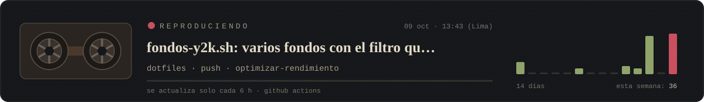</a>


## `>` whoami

```ts
const nakusu = {
  rol:        "Estudiante de Ingeniería de Software · 3er año",
  ahora:      ["Huecko", "SafeZone", "Clínica Biométrica"],
  frontend:   ["React", "TypeScript", "Tailwind", "Vite"],
  backend:    ["Spring Boot", "FastAPI", "PostgreSQL"],
  tambien:    ["diseño", "ilustración", "3D", "edición"],
  filosofia:  "si se ve bien y además funciona, mejor",
};
```

Me muevo entre el diseño y el código: me importa tanto que la arquitectura tenga
sentido como que la interfaz se sienta bien de usar. Aquí subo proyectos de
universidad, prácticas y cosas que hago por curiosidad.


```console
$ git log --oneline --graph side-a
* a5f0e2c (HEAD -> side-a, tag: v0.5.0) feat(huecko): servicio de IA con Gemini + despliegue
* 7c41b9d (tag: v0.4.0) feat(huecko): panel de administración · salud · fallos · consola
* 3e9d1a7 feat(safezone): botón de pánico con GPS y alertas en tiempo real
* 91b27f4 feat(clinica): API de telemedicina con facial-login y Swagger
* 0c0ffee init: ingeniería de software ☕
```


## `>` en qué ando

<details open>
<summary><b>🗓️ &nbsp;Huecko</b> &nbsp;—&nbsp; coordinar planes entre amigos sin 40 mensajes de WhatsApp</summary>

<br/>

<a href="https://github.com/Nakusuo/huecko-frontend">
  
</a>


Sistema completo en tres repos. Los usuarios registran su disponibilidad
(bloques recurrentes y puntuales), la app cruza horarios y propone ventanas
donde el grupo realmente coincide.

- **Heatmap semanal** de disponibilidad del grupo, con umbral configurable
- **Propuestas con votación**: 2–5 ventanas, confirmación, retrasos e imprevistos
- **Importación OCR** de horarios en borrador
- Modo demo sin backend + backend stub para desarrollo
- Contrato de API documentado entre front y Spring Boot


<details>
<summary><b>🏗️ &nbsp;Arquitectura — tres repos, una sola idea</b></summary>

<br/>

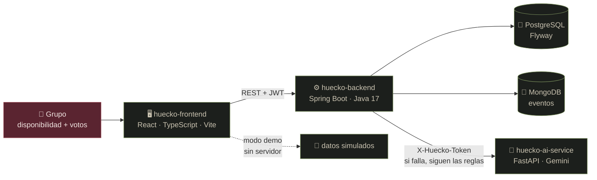
```mermaid
flowchart LR
    U["👥 Grupo<br/>disponibilidad + votos"]:::a --> F["🖥️ huecko-frontend<br/>React · TypeScript · Vite"]
    F -- "REST + JWT" --> B["⚙️ huecko-backend<br/>Spring Boot · Java 17"]
    B --> PG[("🐘 PostgreSQL<br/>Flyway")]
    B --> MG[("🍃 MongoDB<br/>eventos")]
    B -- "X-Huecko-Token<br/>si falla, siguen las reglas" --> IA["🤖 huecko-ai-service<br/>FastAPI · Gemini"]
    F -. "modo demo<br/>sin servidor" .-> D["🧪 datos simulados"]
    classDef a fill:#5a2430,color:#f1e6e2,stroke:#9B4A55
    classDef default fill:#1C1F1C,color:#C9C2B0,stroke:#7A8F5C
```

- **La IA no es un punto de falla:** el servicio no guarda datos; si Gemini tarda o se cae, el backend sigue con sus reglas.
- **Persistencia híbrida:** lo relacional en PostgreSQL (con migraciones Flyway), los eventos en MongoDB.
- **Tres formas de arrancar el front:** conectado (proxy de Vite → Spring Boot), `dev:stub` (backend de mentira) y `dev:demo` (sin servidor).
- **El admin observa, no gestiona:** resumen, salud de las bases, fallos y consola en vivo, sin secretos.

</details>

<details>
<summary><b>🗳️ &nbsp;Vida de un plan — del hueco al imprevisto</b></summary>

<br/>

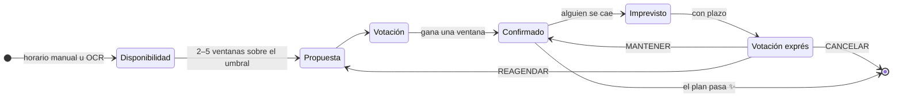
```mermaid
stateDiagram-v2
    direction LR
    state "Disponibilidad" as D
    state "Propuesta" as P
    state "Votación" as V
    state "Confirmado" as C
    state "Imprevisto" as I
    state "Votación exprés" as VE
    [*] --> D: horario manual u OCR
    D --> P: 2–5 ventanas sobre el umbral
    P --> V
    V --> C: gana una ventana
    C --> I: alguien se cae
    I --> VE: con plazo
    VE --> C: MANTENER
    VE --> P: REAGENDAR
    VE --> [*]: CANCELAR
    C --> [*]: el plan pasa ✨
```

La IA lee el motivo de la ausencia, decide si es **crítica** y sugiere `MANTENER`, `REAGENDAR` o `CANCELAR` — con los hechos del aviso, no con los votos.

</details>

<details>
<summary><b>🏷️ &nbsp;Releases</b></summary>

<br/>

| Versión | Qué trajo |
|---|---|
| `v0.5.0` | **IA y despliegue** — servicio de IA con Gemini, front + back + IA publicados |
| `v0.4.0` | **Panel de administración** — resumen, salud, fallos y consola en vivo |

</details>

**Repos:** [`huecko-frontend`](https://github.com/Nakusuo/huecko-frontend) · [`huecko-backend`](https://github.com/Nakusuo/huecko-backend) · [`huecko-ai-service`](https://github.com/Nakusuo/huecko-ai-service)

</details>

<details>
<summary><b>🛡️ &nbsp;SafeZone</b> &nbsp;—&nbsp; plataforma de apoyo a víctimas de violencia</summary>

<br/>

<a href="https://github.com/Nakusuo/SafeZone_Frontend">
  
</a>


Cuatro roles, cuatro dashboards: administradora, víctima, psicóloga y defensor
legal. Arquitectura *feature-based* pensada para que cada dominio crezca por
separado.

- **Botón de pánico** flotante con geolocalización GPS, alternativa manual y
  countdown de 10s antes del auto-envío
- **Panel de alertas en tiempo real** para que las profesionales atiendan y
  resuelvan casos
- Gestión de denuncias por tipo de violencia
- Modo mock ↔ backend real conmutable por variable de entorno


<details>
<summary><b>🚨 &nbsp;Así viaja una alerta de pánico</b></summary>

<br/>

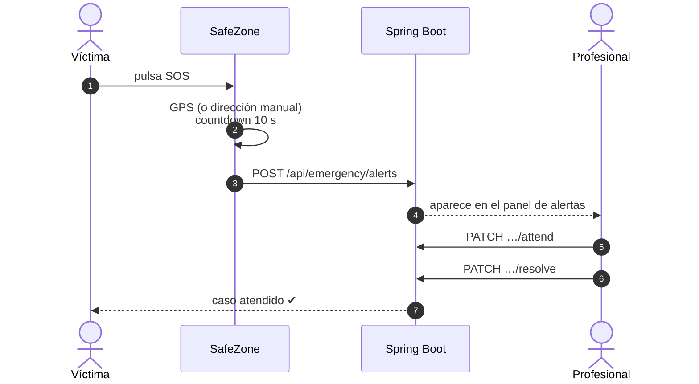
```mermaid
sequenceDiagram
    autonumber
    actor V as Víctima
    participant App as SafeZone
    participant API as Spring Boot
    actor P as Profesional
    V->>App: pulsa SOS
    App->>App: GPS (o dirección manual)<br/>countdown 10 s
    App->>API: POST /api/emergency/alerts
    API-->>P: aparece en el panel de alertas
    P->>API: PATCH …/attend
    P->>API: PATCH …/resolve
    API-->>V: caso atendido ✔
```

```text
src/
├── core/       → auth, apiClient, router
├── features/   → admin · auth · victim · psychologist · defender · shared-features
├── shared/     → UI, tipos, utilidades
└── data/       → mockData.json  (VITE_USE_MOCK=true)
```

</details>

**Repo:** [`SafeZone_Frontend`](https://github.com/Nakusuo/SafeZone_Frontend)

</details>

<details>
<summary><b>🩺 &nbsp;Clínica Biométrica</b> &nbsp;—&nbsp; telemedicina con login facial</summary>

<br/>

<a href="https://github.com/Nakusuo/Backend-ClinicaBiometrica">
  
</a>


API de telemedicina: pacientes, doctores, citas y expedientes, con
autenticación JWT y un endpoint de *facial-login*. Documentada en Swagger
desde el primer commit. El frontend va en Angular 16 con videollamadas WebRTC.


<details>
<summary><b>🧬 &nbsp;Mapa de la API</b></summary>

<br/>

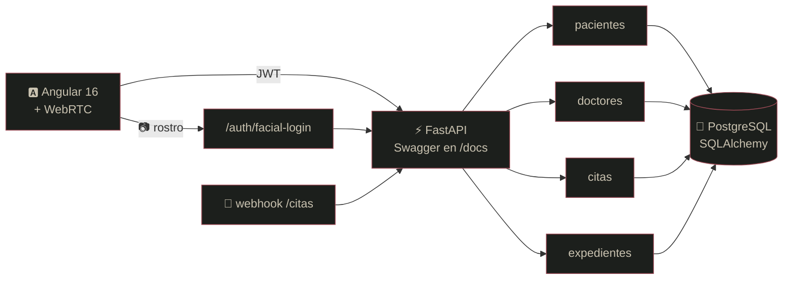
```mermaid
flowchart LR
    A["🅰️ Angular 16<br/>+ WebRTC"] -- "JWT" --> API["⚡ FastAPI<br/>Swagger en /docs"]
    A -- "📷 rostro" --> FL["/auth/facial-login"]
    FL --> API
    API --> R1["pacientes"] & R2["doctores"] & R3["citas"] & R4["expedientes"]
    R1 & R2 & R3 & R4 --> DB[("🐘 PostgreSQL<br/>SQLAlchemy")]
    WH["🔔 webhook /citas"] --> API
    classDef default fill:#1C1F1C,color:#C9C2B0,stroke:#9B4A55
```

</details>

**Repos:** [`Backend-ClinicaBiometrica`](https://github.com/Nakusuo/Backend-ClinicaBiometrica) · [`Frontend-ClinicaBiometrica`](https://github.com/Nakusuo/Frontend-ClinicaBiometrica)

</details>

<details>
<summary><b>📚 &nbsp;Universidad y prácticas</b></summary>

<br/>

Repos de curso donde voy dejando ejercicios y entregas: `ProyectoMesaDePartes`, `CHALK`,
`Lenguajes_Programacion-Frontend`, `semana14-DWI`, `Semana-11-appMovil` y
`Estrucutra-de-datos---Cafeteria`. No son portafolio, son el registro de cómo voy aprendiendo.

</details>

<details>
<summary><b>🌙 &nbsp;Cosas que hice para alguien</b></summary>

<br/>

Páginas pequeñas hechas a mano, sin framework y sin motivo práctico: `4Skate`, `5minutos`, `5555`.
Están ahí por si alguien las encuentra.

</details>


## `>` stack

<table>
  <tr>
    <td align="center" width="130"><sub><b>FRONT</b></sub></td>
    <td></td>
  </tr>
  <tr>
    <td align="center"><sub><b>BACK</b></sub></td>
    <td></td>
  </tr>
  <tr>
    <td align="center"><sub><b>DISEÑO</b></sub></td>
    <td></td>
  </tr>
  <tr>
    <td align="center"><sub><b>HERRAMIENTAS</b></sub></td>
    <td></td>
  </tr>
</table>


<details open>
<summary><b>Lo que uso a diario</b></summary>

<br/>


</details>

<details>
<summary><b>Diseño y visuales</b></summary>

<br/>


</details>

<details>
<summary><b>En la lista de aprender</b></summary>

<br/>


</details>


## `>` métricas

<div align="center">

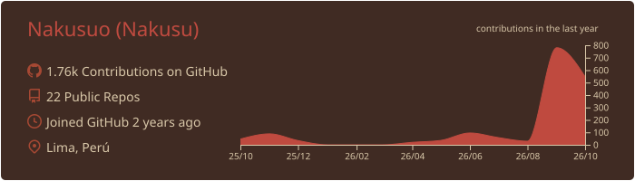

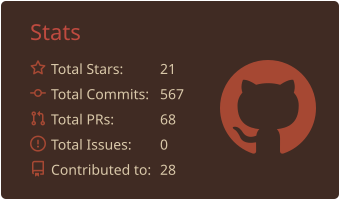
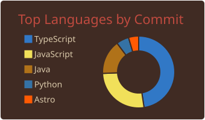

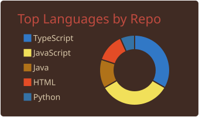
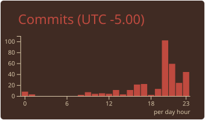


</div>


## `>` mis commits, pero como videojuego

<div align="center">
  
</div>

<div align="center">
  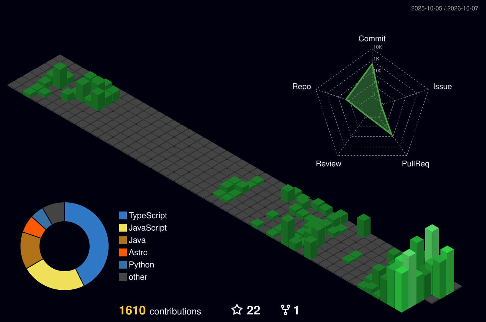
</div>


## `>` últimos movimientos

<!--START_SECTION:activity-->
1. 🎉 Merged PR [#2](https://github.com/Nakusuo/dotfiles/pull/2) in [Nakusuo/dotfiles](https://github.com/Nakusuo/dotfiles)
2. 💪 Opened PR [#2](https://github.com/Nakusuo/dotfiles/pull/2) in [Nakusuo/dotfiles](https://github.com/Nakusuo/dotfiles)
3. 🎉 Merged PR [#1](https://github.com/Nakusuo/dotfiles/pull/1) in [Nakusuo/dotfiles](https://github.com/Nakusuo/dotfiles)
4. 💪 Opened PR [#1](https://github.com/Nakusuo/dotfiles/pull/1) in [Nakusuo/dotfiles](https://github.com/Nakusuo/dotfiles)
5. 🚀 Published release [v0.5.0 · IA y despliegue](https://github.com/Nakusuo/huecko-ai-service/releases/tag/v0.5.0) in [Nakusuo/huecko-ai-service](https://github.com/Nakusuo/huecko-ai-service)
<!--END_SECTION:activity-->


<a name="side-b"></a>

<details>
<summary><sub><code>▸ side B</code></sub></summary>

<br/>



```text
 ┌──────────────────────────────────────────────┐
 │  cinta encontrada en una carpeta sin nombre  │
 │                                              │
 │  05  commits a las 2am                       │
 │  06  "arreglo esto mañana" (no lo arregló)   │
 │  07  el CSS que sí funcionó a la primera     │
 │  08  ruido blanco                            │
 └──────────────────────────────────────────────┘
```

Si estás leyendo esto es porque abriste el desplegable. Bien hecho. `|-/`

</details>



<div align="center">
  <sub><code>~/Nakusuo</code> &nbsp;·&nbsp; construido con demasiado café y atajos de teclado ☕</sub>
</div>
